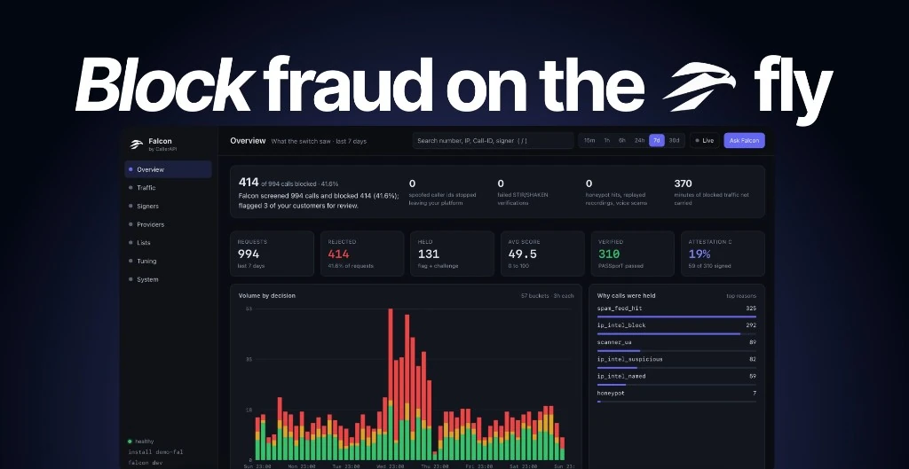

<p align="center">
  
</p>

# CallerAPI Falcon

Falcon is a SIP risk engine that runs next to your switch. It reads each
INVITE, verifies STIR/SHAKEN, names the provider behind the source IP, applies
your allow and deny rules, scores the request, and returns an action. The
switch keeps signaling and media. Falcon never sits in the call.

One binary. One SQLite file. No external service. A laptop and a fleet of a
thousand nodes run the same build with the same configuration.

## What you get

1. **STIR/SHAKEN verification.** Falcon fetches the signing certificate,
   verifies the ES256 signature, chains it to the STI-PA list of trusted
   CAs, checks the STI-PA CRL, checks freshness and the orig and dest claims,
   and reads the signer's Service Provider Code from the certificate. The SPC
   is the provider that attested the call. It is on every event and in the
   `X-Falcon-Signer` header.
2. **Telecom IP intel.** A CSV of CIDR blocks names the provider behind every
   source IP and carries a risk. Bring your own table or connect the hosted
   CallerAPI table.
3. **Lists.** Allow and deny by calling number, source IP or CIDR, and signer
   SPC. Deny is a hard reject. Allow ends scoring. Rules can expire.
4. **A local score** from SIP header shape, User-Agent, velocity, and the
   signals above. An action: `allow`, `flag`, `challenge`, or `reject`, with
   the reasons.
5. **A dashboard** on the same process: overview, traffic with live tail,
   signers, providers, lists, tuning, system. No build step, no external
   fonts or scripts.
6. **An operator API**: filtered events with cursors, stats, histogram,
   parties, rules, server-sent events, CSV export, `/metrics` for Prometheus.
7. **Optional paid connections** to CallerAPI: the spam database feed and the
   live voice firewall lookup.
8. **Business Caller ID.** On by default when a CallerAPI key is set. Falcon
   verifies each INVITE for free. A spoofed registered brand is a hard
   reject. A verified name is put in `X-Falcon-BCID-Name` and
   `Remote-Party-ID` when the switch can set those headers.

## Telemetry: on by default, called party redacted

Falcon shares redacted screening events with CallerAPI. This is on by
default. Every install that shares makes detection better for every other
install, and it is how a free engine stays maintained. If you would rather
not, one flag turns it off and nothing leaves the host.

What is sent, every 30 seconds, in batches of up to 100:

| Field | Sent |
| --- | --- |
| Decision, score, reasons | Yes |
| Calling number (the party being scored) | Yes |
| Source IP, User-Agent, Call-ID, switch label | Yes |
| Signer SPC and name, verification result | Yes |
| SIP request line and headers | Yes, after redaction below |
| Install id, Falcon version | Yes |

What is never sent:

| Field | What happens |
| --- | --- |
| Called number (your subscriber) | Replaced with `REDACTED` in the `to` field, the Request-URI, `To`, `P-Called-Party-ID`, and every other header, the Call-ID, and reason text |
| Called display name | Removed with the header |
| Forwarding numbers (`Diversion`, `History-Info`, `Referred-By`) | Replaced with `REDACTED` |
| PASSporT (`Identity` header) | Removed. It carries the called number in its `dest` claim. The verification result is sent instead |
| SDP body | Dropped. It carries media addresses and SRTP keys |
| Calling number when it equals the called number | Replaced with `REDACTED` and marked `from_equals_to` |

A keyed hash of the called number (`to_hmac`) travels instead of the number.
The key is a random secret created on this install and never sent, so
CallerAPI can count how many of your subscribers one campaign reached
without learning who they are, and cannot join it across installs.

Falcon logs the telemetry state on every boot. The System view shows the
same, with the exact endpoint and a sample of a redacted INVITE. Every
shared event is also in your local database, so you can audit what left.

To opt out:

```
FALCON_SHARE=false
```

or untick "Share redacted screening events" in the System view. The
dashboard opt-out applies within 30 seconds and survives restarts. The
environment flag wins over the dashboard.

If you screen outbound calls on the same switch, the calling number is your
subscriber. Run that switch with `FALCON_SHARE=false`.

Set `CALLERAPI_API_KEY` to have your account credited for the contribution.
Without a key the install is anonymous.

Every install signs its telemetry with an Ed25519 key created on first boot
and kept in the local database. CallerAPI binds the install id to that key
on first sight and refuses a later post with another key. The private key
never leaves the host.

## Network reputation: the return leg

Installs that share get back what the whole network has seen. Once an hour
Falcon fetches a feed with a score per signer (STIR/SHAKEN Service Provider
Code) and per sending tool (SIP fingerprint, see below), built from every
sharing install over the last 7 days. CallerAPI serves the feed to installs
that have shared for at least a day, or that carry a key.

A score is a rate of failed verifications, rejects, and spam database hits,
capped by evidence: one install behind it caps at 50, two at 70, five with
a few hundred calls can reach 100. The Signers view shows it in the
`network` column. The event drawer shows it per call.

By default the feed is corroboration. A signer or tool with a score of 70
or more across at least 3 installs adds weight to the local score and can
lift a call to flag or challenge, never to reject on its own. Set
`FALCON_REPUTATION_ENFORCE=true` and a signer with a score of 90 or more
across at least 5 installs is a hard reject with `X-Falcon-Block:
network_signer`. `FALCON_REPUTATION=false` turns the feed off.

The same data is sold as the CallerAPI signer reputation API
(`GET /api/signer-reputation/{spc}`) to carriers and analytics vendors that
do not run Falcon. Sharing installs get it free, inside the engine.

## SIP fingerprints

Falcon hashes the habits of the software that sent each INVITE: header
order, the `Allow`, `Supported`, and `User-Agent` values, the shape of the
Call-ID and tags, the transport, and the SDP codec order and attributes.
Never a number, an address, a port, a key, or a time. The result is a 16
character `fingerprint` on every event, searchable in Traffic and grouped
in `/v1/parties?by=fingerprint`. The drawer lists the parts behind it.

A fingerprint names a tool, not a party, and a common tool is shared by
good and bad traffic alike. That is why the feed scores it by what the
network saw from it and why it is corroboration, never a verdict on its
own. Where it earns its keep: a scam operation rotates numbers weekly and
signers rarely, but it almost never rotates its dialer. New numbers from a
tool the network already scored badly arrive pre-flagged.

## Outbound: fraud from your own platform

Inbound screening protects your subscribers. Outbound screening protects
you. A robocall or a spoofed caller id that leaves your network under your
STIR/SHAKEN certificate is what regulators fine, and the traceback lands
on your desk.

Register each customer and the numbers it may present:

```
curl -X PUT -H 'X-Falcon-Token: ...' -H 'Content-Type: application/json' \
  -d '{"id":"acme","name":"Acme Dialer","dids":["+13125550100","+1312555*"]}' \
  http://127.0.0.1:8090/v1/customers
```

Mark outbound calls with `direction: "outbound"` and `customer: "acme"`
(or the `X-Direction` and `X-Customer` headers on a raw SIP post; the
adapters read `falcon_direction` and `falcon_customer` channel variables).
Then:

- A caller id outside the customer's list is a hard reject
  (`caller_id_not_owned`, SIP 603, `X-Falcon-Block: caller_id`) and the
  webhook fires at once with `customer_id`, `calling_number`, the
  customer's numbers, and `suggested_action`.
- Every call from the customer carries the account label, so the Lists,
  Traffic, alerts, and the traceback pack can be filtered by customer.
- The alert watcher pages when a customer's reject rate crosses
  `alert_customer_reject_pct` (default 30% over 50 calls in 15 minutes).

Report how calls end and Falcon scores behaviour too:

```
curl -X POST -H 'X-Falcon-Token: ...' -H 'Content-Type: application/json' \
  -d '{"call_id":"abc@10.0.0.5","answered":true,"duration_s":7,"hangup_cause":"NORMAL_CLEARING"}' \
  http://127.0.0.1:8090/v1/outcome
```

The adapters do this from the hangup hook. With outcomes, every screen
sees the calling number's last hour: `caller_fanout` (30 different numbers,
`FALCON_FANOUT_PER_HOUR`), `sequential_dialing` (5 consecutive numbers,
`FALCON_SEQUENTIAL_N`), `caller_low_asr` (20 completed calls, at most 20%
answered), `caller_short_calls` (10 answered, at most 12 seconds on
average), and `caller_hits_honeypots`. These are the numbers behind every
robocall detector in the industry; here they run on your own switch.

The webhook payload a platform can act on without parsing prose:

```json
{"text": "[falcon critical] Customer acme presented a caller id it does not own\n...",
 "falcon": {"key": "spoof:acme", "severity": "critical", "title": "...", "detail": "...",
   "install_id": "...", "version": "...", "at": "...",
   "data": {"kind": "outbound_spoof", "customer_id": "acme", "calling_number": "+18005551234",
            "customer_dids": ["+13125550100", "+1312555*"], "source_ip": "10.0.0.5",
            "call_id": "...", "event_id": 4471, "suggested_action": "suspend_outbound_and_review"}}}
```

`kind` is one of `outbound_spoof`, `customer_reject_rate`,
`repeat_recording`, `voice_scam`. The platform unassigns the DID or
suspends outbound for the account and opens a case; Falcon has already
kept the evidence.

## Discovering new spam numbers

A number nobody has complained about yet cannot be in a list. It is found
by what it does:

1. **Honeypot numbers.** List the numbers and prefixes in your inventory
   that are not assigned to anyone as `honeypot` rules
   (`{"kind":"honeypot","subject":"number","value":"+1415555999*"}`).
   Nobody legitimate dials an unassigned number. A call to one scores 70;
   a caller that hits two in an hour scores 60 more.
2. **Behaviour.** Fan-out, sequential dialing, low answer rate, short
   calls, from the outcomes above.
3. **The same recording again.** See voice analysis below: a perceptual
   hash of the first seconds catches a prerecorded message on its third
   play, with no model involved.
4. **The network.** Telemetry carries the outcome, the honeypot flag, and
   a keyed hash of the called party, so CallerAPI can see one number
   reaching many subscribers across installs. Numbers that two independent
   installs rejected, or one rejected with a failed verification, or that
   hit honeypots, are filed to the spam database and reach the feed.

## Voice analysis: when the model listens

A model that hears every call is a cost nobody carries. Falcon lets
signaling choose. A call is sampled when it is a honeypot target, a
sequential dialer, a fan-out caller, a low-answer or short-call caller,
scored by the network, or an outbound call that is not clean. The switch
gets `X-Falcon-Sample: 1` and `X-Falcon-Sample-Seconds`, records the first
seconds with the legs on separate channels, and posts the WAV to
`POST /v1/audio?call_id=...` at hangup (the adapters do this). Budget:
`FALCON_VOICE_SAMPLES_PER_HOUR` (60) and
`FALCON_VOICE_SAMPLES_PER_CUSTOMER_HOUR` (10).

Two checks run on the host for free, before any model:

- **Repeat recording.** A 64 bit hash of the caller leg's energy envelope.
  The same message played again matches within a few bits. Three plays in
  24 hours fire `repeat_recording`. No transcript needed.
- **Monologue.** One leg talks for the whole clip, the other stays silent.
  A recording played at a person.

Then, if a provider is configured, the clip is transcribed and classified
into the CallerAPI complaint categories:

```
# Any OpenAI-compatible pair: OpenAI, Groq, xAI for chat, a local Whisper server for speech
FALCON_VOICE_PROVIDER=openai
FALCON_VOICE_STT_BASE_URL=https://api.openai.com/v1
FALCON_VOICE_STT_API_KEY=sk-...
FALCON_VOICE_STT_MODEL=whisper-1
FALCON_VOICE_CHAT_BASE_URL=https://api.x.ai/v1
FALCON_VOICE_CHAT_API_KEY=xai-...
FALCON_VOICE_CHAT_MODEL=grok-3-mini

# Or the CallerAPI scan API on your account key, billed by the minute
FALCON_VOICE_PROVIDER=callerapi
CALLERAPI_API_KEY=...
```

Transcripts, categories, and summaries live in the local database and in
the event drawer. They are never shared. Telemetry carries the category
and score only. A scam verdict at 0.7 or above fires `voice_scam` on the
webhook with the category, summary, customer, and calling number. With
the CallerAPI provider and `FALCON_VOICE_REPORT=true` (default), a scam
verdict also files the calling number in the spam database.

## Run

```bash
cp .env.example .env
go test ./...
go run ./cmd/falcon
```

Docker:

```bash
cp .env.example .env
docker compose up --build
```

Open `http://127.0.0.1:8090`. Set `FALCON_LISTEN=0.0.0.0:8090` if the process
runs in a container.

Set `FALCON_TOKEN` before you expose the port. Send that token in
`X-Falcon-Token`, in `Authorization: Bearer`, or as `?token=` for the
dashboard and event streams.

## Screen a call

```bash
curl -sS -X POST http://127.0.0.1:8090/v1/screen \
  -H 'Content-Type: application/json' \
  -H "X-Falcon-Token: $FALCON_TOKEN" \
  -d '{"switch":"curl","source_ip":"198.51.100.20","raw_sip":"INVITE sip:+15551212@ex SIP/2.0\r\nVia: SIP/2.0/UDP 198.51.100.20;branch=z9hG4bK1\r\nFrom: <sip:+14155550100@ex>;tag=1\r\nTo: <sip:+15551212@ex>\r\nCall-ID: demo\r\nUser-Agent: friendly-scanner\r\nMax-Forwards: 70\r\n\r\n"}'
```

Switch adapters for Asterisk (and the FreePBX family), FreeSWITCH (and
FusionPBX), Kamailio, OpenSIPS, and ConnexCS live in `adapters/`. Each one
is tested in CI against a live Falcon on a real switch container.

On a class 4 or wholesale ingress run `FALCON_PROFILE=carrier`. The default
scoring is tuned for a PBX trunk and rejects a normal call center CLI
within its first hour there. The carrier profile keeps hard blocks and
turns everything else into a flag. See `adapters/README.md`.

Falcon fails open when it cannot parse the request. The switch continues the
call.

## Screen over SIP, no script

A switch or SBC with no script hook routes the INVITE to Falcon first, as
it would to a redirect server. Falcon answers `302` to continue or `603`
to drop and is out of the dialog. Signaling and media stay on the switch.

```
FALCON_SIP_LISTEN=0.0.0.0:5060
FALCON_SIP_PEERS=203.0.113.10,198.51.100.0/24
```

`FALCON_SIP_PEERS` is the gate: only those IPs and CIDRs get an answer.
`OPTIONS` gets `200 OK` for health probes. UDP and TCP on one port. This is
the path for Sansay, Sippy, PortaSwitch, Metaswitch, Ribbon, Oracle,
AudioCodes, Cisco CUBE, and any proprietary class 4 platform. Details and
per-vendor notes are in `adapters/README.md`.

## Score

The engine adds weights and caps the total at 100.

| Band | Score | Action |
| --- | --- | --- |
| low | 0-39 | allow |
| medium | 40-59 | flag |
| elevated | 60-79 | challenge |
| high | 80-100 | reject |

Thresholds are `FALCON_FLAG_SCORE`, `FALCON_CHALLENGE_SCORE`, and
`FALCON_REJECT_SCORE`. The Tuning view shows where they sit against your
traffic and prints the values to apply.

Hard rejects skip the score: a deny rule, a spam feed hit, or an IP intel
`block` row. The response carries `X-Falcon-Block` with the source.

## STIR/SHAKEN

Verification is on by default. Falcon loads the trusted CA list from the
public STI-PA endpoint and the CRL from the STI-PA download, and refreshes
both on a timer. Each screened Identity header gets a `verstat`:

| Verstat | Meaning |
| --- | --- |
| `TN-Validation-Passed` | Signature, chain, validity, CRL, freshness, and orig all check out. |
| `TN-Validation-Failed` | At least one check failed. The reasons say which. |
| `No-TN-Validation` | No Identity header, or the certificate could not be fetched in time. |

The switch never waits on a cold cache. A fetch that misses the per-call
budget (`FALCON_SHAKEN_BUDGET`, default 400 ms) returns `No-TN-Validation`
and warms the cache for the next call. Chains are cached for an hour.

The signer's SPC and organization are on the event, in `X-Falcon-Signer`,
and aggregated in the Signers view. A deny rule on an SPC rejects every call
that provider signs.

Air-gapped hosts: set `FALCON_SHAKEN_CA_FILE` to a PEM bundle and set
`FALCON_SHAKEN_CA_URL=off` and `FALCON_SHAKEN_CRL_URL=off`.

### The STI-PA list is verified

The CA list from the STI-PA is a JWS. Falcon checks its ES256 signature with
the certificate the list names, requires that certificate to come from the
same host as the list and to name the STI-PA, checks its validity period
and the list's `exp`, and refuses a list whose sequence number is lower
than the last one accepted. A refresh that fails any check keeps the last
good list. Two optional tightenings:

```
FALCON_SHAKEN_PA_PIN=<base64 SHA-256 of the list-signing certificate's SPKI>
FALCON_SHAKEN_PA_ROOT_FILE=/etc/falcon/sti-pa-root.pem
```

To compute the pin from the certificate the list currently names:

```
openssl x509 -in ca-listCert.crt -noout -pubkey | openssl pkey -pubin -outform der | openssl dgst -sha256 -binary | base64
```

`FALCON_SHAKEN_VERIFY_LIST=false` turns the check off for a lab rig and
logs a warning at start.

## Telecom IP intel

The table is a CSV of CIDR blocks:

```
cidr,provider,risk,tags,source
18.139.118.128/27,8x8 Inc,trusted,official|voice,provider
4.150.191.0/24,Unregistered cloud voice,block,voip,fraud
```

`risk` is `trusted`, `neutral`, `suspicious`, `hostile`, or `block`. A `block`
row is a hard reject. `hostile` adds 60, `suspicious` adds 30. Longest prefix
wins. A bare IP is a `/32`.

```
FALCON_IP_INTEL_FILE=/data/ipintel.csv
FALCON_IP_INTEL_URL=https://api.callerapi.com/api/ip-intel/v1/list.csv
FALCON_IP_INTEL_REFRESH=1h
```

Load a file, a URL, or both. A local row overrides a hosted one. With a
CallerAPI key, `FALCON_IP_INTEL=true` loads the hosted table. A key alone
gets the fraud list. The provider overlay needs the admin switch. The switch
gets `X-Falcon-Provider`. A starter file is in `examples/ipintel.csv`.

Zoom walkthrough: `falcon demo seed`, then `FALCON_DEMO=true` and
`falcon demo swap paid`. See `examples/demo/README.md`.

## Lists

```bash
curl -sS -X POST http://127.0.0.1:8090/v1/rules -H "X-Falcon-Token: $FALCON_TOKEN" \
  -H 'Content-Type: application/json' \
  -d '{"kind":"deny","subject":"spc","value":"1234","note":"gateway under traceback","ttl":"168h"}'
```

`subject` is `number`, `ip` (an address or a CIDR), or `spc`. `ttl` is
optional. Rules apply on the next INVITE. The dashboard adds and removes them
from any row.

## API

All endpoints take the token. Ranges are `range=15m|1h|6h|24h|7d|30d` or
`from` and `to` as RFC 3339.

| Method and path | Purpose |
| --- | --- |
| `POST /v1/screen` | Score one request. |
| `GET /v1/events` | Events. Filters: `action`, `verstat`, `ip`, `spc`, `provider`, `fingerprint`, `number`, `q`. Cursor: `before`. |
| `GET /v1/events/{id}` | One event with raw SIP, the verification result, the fingerprint parts, and the network rows for its signer and tool. |
| `GET /v1/events.csv` | CSV export with the same filters. |
| `GET /v1/stats` | Counts, top lists, and a dense timeseries. |
| `GET /v1/histogram` | Ten score buckets and the live thresholds. |
| `GET /v1/parties?by=signer|provider|ip|fingerprint|customer|caller` | Per-entity totals, reject rate, attestation mix, verstat, distinct callers, and the network score for signers and tools. |
| `GET /v1/rules`, `POST /v1/rules`, `DELETE /v1/rules/{id}` | Allow and deny rules. |
| `GET /v1/stream` | Server-sent events, one per screened request. |
| `POST /v1/reload` | Reload the IP intel table, the trust list, the CRL, and the rules. |
| `GET /v1/settings`, `PUT /v1/settings` | Runtime settings: retention, raw SIP retention, telemetry sharing. |
| `GET /v1/alerts`, `GET|PUT /v1/alerts/settings`, `POST /v1/alerts/test` | Fired alerts, webhook and thresholds, a test message. |
| `GET /v1/audit` | Who changed what. |
| `GET /v1/traceback.zip?spc=|number=|ip=|fingerprint=` | The traceback pack. |
| `POST /v1/outcome` | How a call ended: `call_id`, `answered`, `duration_s`, `hangup_cause`. |
| `POST /v1/audio?call_id=` | The first seconds of a sampled call as WAV (body or multipart `audio`). |
| `GET /v1/voice/samples` | Clips with features, transcript, category. |
| `GET|PUT /v1/customers`, `GET|DELETE /v1/customers/{id}` | Customers and the numbers they may present; activity per customer. |
| `GET /v1/status`, `GET /v1/config`, `GET /v1/health` | State, redacted configuration, liveness. |
| `GET /metrics` | Prometheus text exposition. |

## Alerts

A watcher evaluates the last 15 minutes every minute and posts to a
webhook when a threshold is crossed: overall reject rate, STIR/SHAKEN
failure rate, per-signer reject rate, and a stale STI-PA list. Each rule
sits behind a minimum call count and fires at most once an hour per key.
Set the webhook and thresholds in the System view or with
`PUT /v1/alerts/settings`. `POST /v1/alerts/test` sends one. Fired alerts
are listed at `GET /v1/alerts`. The payload carries a Slack compatible
`text` field and a `falcon` object with the details, so a Slack incoming
webhook works as is and any JSON receiver gets the structure.

## Audit log

Every change made through the API is recorded with the actor, the action,
the subject, and the detail: rules added or deleted, settings, alert
settings, reloads, traceback exports. `GET /v1/audit` lists them; the
System view shows the last thirty. The actor is the dashboard user, the
token, or the query token, with the client address.

## Traceback pack

`GET /v1/traceback.zip?spc=8080&range=7d` (or `number=`, `ip=`,
`fingerprint=`, `provider=`) builds the archive a traceback request asks
for: `events.csv`, `events.json`, one raw INVITE per call under `sip/`, the
signer certificate chains still in the verifier cache under
`certificates/`, `summary.json`, and a `README.txt` that explains every
column. The Signers view has a `Pack` button per signer. The export is
written to the audit log.

## Storage

Every screen writes a row to the SQLite file at `FALCON_DB_PATH`. Decisions
are kept for `FALCON_RETENTION_DAYS` (default 30). The raw SIP message on each
row is scrubbed after `FALCON_RAW_SIP_RETENTION_DAYS` (default 7) while the
decision stays. Both are editable at runtime from the System view or
`PUT /v1/settings`. `FALCON_STORE_RAW_SIP=false` never writes raw SIP.

If you set S3 variables, Falcon writes JSONL objects to your bucket. That path
is your storage.

Telemetry to CallerAPI is separate from both and is described above. It is
redacted; the S3 export is not, because that bucket is yours.

## Business Caller ID

On when `CALLERAPI_API_KEY` is set. `FALCON_BCID=false` turns it off.

Falcon calls `POST /api/bcid/v1/verify` on each screen. The telco is not
charged. The registered business pays 2 credits when it announces the
call. A verified check gives the telco 1 credit.

A spoofed registered brand is a hard reject (`X-Falcon-Block: bcid`).
A verified or unverified name is returned in `bcid_name` and in
`headers_to_set`. Adapters that can inject SIP headers set
`X-Falcon-BCID`, `X-Falcon-BCID-Name`, and `Remote-Party-ID`. The SIP
redirect listener also copies `Remote-Party-ID` and `Call-Info`.

Do not put a business API key or a publish token on the switch.

## Paid add-ons

The engine, verification, lists, IP intel, dashboard, API, and Business
Caller ID stay free for the telco.

Spam database feed:

```
CALLERAPI_API_KEY=...
FALCON_SPAM_FEED=true
```

Falcon downloads `/api/spam-reports/csv` on a timer. A From number on that
list is a hard reject.

Voice firewall:

```
CALLERAPI_API_KEY=...
FALCON_VOICE_FIREWALL=true
```

Falcon calls `/api/lookup/{phone}` on each screen. For inline SIP blocking at
the edge, use the hosted product at https://callerapi.com/sip-firewall.

## Configuration

See `.env.example`. Every value has a default. Secrets never appear in
`/v1/config`; it shows `set` or empty.

## Security and privacy

Read `SECURITY.md` before the first install. In short: untrusted URLs are
fetched only to public addresses over https with tight caps, the switch is
never held longer than the budget, mutations refuse cross-site form
submissions, the dashboard runs under a strict content security policy, an
empty token on a public listen stops startup, raw SIP has its own short
retention, telemetry never carries the called party, and nothing leaves the
host that the System view does not list.

## Releases

Tagged releases (`v*`) publish binaries for linux and darwin on amd64 and
arm64, a `checksums.txt` signed with cosign (keyless, GitHub OIDC), an SBOM
per archive, and multi-arch images at `ghcr.io/callerapi/falcon:<version>`
signed the same way. The release notes carry the verify commands. Pin a
version in production and read `CHANGELOG.md` before moving.

## Build

```bash
make build            # bin/falcon
make build VERSION=1.0.0
```

## Ask Falcon: the assistant

The Overview opens with the value card: calls screened, calls blocked and
the percentage, spoofed caller ids stopped leaving your platform, failed
verifications, honeypot hits, replayed recordings, voice scams, customers
flagged, and an estimate of the minutes of blocked traffic you did not
carry. It is computed from your own database with no model, so the proof
of value never depends on a key. `GET /v1/value?range=24h` returns it.

`Ask Falcon` (top right, or press `A`) opens a chat that answers
questions about this install's data: what was blocked and from whom, which
customer to look at first, which signer is behind the rejects, what to
tighten. The model only sees the value card and the window; it is told to
use nothing else and to never invent a number. Bring your own model or use
your CallerAPI key:

```
FALCON_ASSISTANT_PROVIDER=openai          # any OpenAI-compatible chat endpoint
FALCON_ASSISTANT_BASE_URL=https://api.x.ai/v1
FALCON_ASSISTANT_API_KEY=xai-...
FALCON_ASSISTANT_MODEL=grok-3-mini

FALCON_ASSISTANT_PROVIDER=callerapi       # on CALLERAPI_API_KEY, no other setup
```

Without a provider the panel still shows the value card and answers with
its sentence.

## For AI agents

`AGENTS.md` is a runbook for a coding agent: stand Falcon up in five
minutes, connect a switch, the variables that matter first, how to verify a
change, and the rules that must not be broken. Point your agent at it.

## Trademarks

Falcon and CallerAPI are trademarks of CallerAPI LC. The Apache License
grants the code, not the marks. Run it, fork it, sell services on it; do
not call a fork "Falcon" or imply CallerAPI endorsement. Adopters who agree
to be named are listed in `ADOPTERS.md`.

## License

Apache License 2.0. See `LICENSE`.
